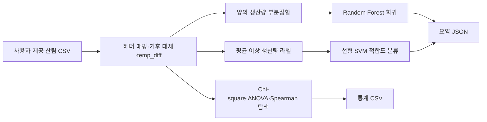

# 산림 작물 적합지·생산량 분석

[English](README.md)

> [프로젝트 자세히 보기](PORTFOLIO.ko.md)

토양·기후 변수와 산림 작물 생산량의 관계를 탐색하는 의사결정 지원 워크플로입니다. 유지되는 Python 진입점은 사용자가 제공한 CSV로 통계적 연관성 점검, Random Forest 생산량 회귀, 선형 SVM 적합도 분류를 실행합니다.

> **근거 범위:** 원본 분석 CSV는 포함하지 않습니다. 소스 링크, 노트북, 코드, 보고서 PDF, 보관 그림은 남아 있지만, 원래 입력 데이터와 컬럼 헤더 없이는 과거 점수를 다시 만들 수 없습니다.

## 문제와 데이터 범위

양의 생산량과 토양·기후 조건의 관계를 살피고, 생산량을 예측하며, 특정 작물에서 평균 생산량 이상인 관측치를 분류합니다. `data/임업통계 데이터 셋 출처(이준형).txt`에는 통계·토양·기후·생산량 데이터 출처가 적혀 있지만, 분석 CSV는 없습니다. 따라서 행 수·기간·공간 단위·타깃 정의·원래 분할 정보는 현재 확인할 수 없습니다.

`src/data_loader.DataLoader`는 역사적 한글 헤더 또는 `chestnut_kg`, `avg_temp`, `humidity`, `precipitation` 같은 영문 헤더를 처리합니다. 기후 결측치는 컬럼 평균으로 채우고, 최고·최저 기온이 있으면 `temp_diff`를 만듭니다.

## 유지되는 흐름



| 단계 | 구현 내용 |
|---|---|
| 통계 점검 | `StatAnalyzer`가 양의 생산량 분위수 구간, 일원 ANOVA, Spearman 상관을 계산합니다. 인과 추정이 아닌 탐색입니다. |
| 회귀 | `CropPredictor`가 양의 생산량만 사용해 median imputation+Random Forest 파이프라인을 학습하고, 80/20 holdout R²/MSE와 CV R²를 기록합니다. |
| 분류 | `CropClassifier`는 전체 입력의 평균 이상 생산량을 적합으로 정의하고, imputation·scaling·선형 SVM을 한 파이프라인에서 실행합니다. |

## 보관된 역사적 결과

| 작물 | ROC 이미지 표기 | 해석 |
|---|---:|---|
| 밤 | 0.94 | `images/roc_chestnut.png`의 역사적 산출물 |
| 마 | 0.91 | `images/roc_yam.png`의 역사적 산출물 |
| 복분자 | 0.84 | `images/roc_blackberry.png`의 역사적 산출물 |

분할·표본 수·생성 환경이 남아 있지 않아 위 숫자는 현재 재현성 벤치마크나 실제 재배 성공률이 아닙니다.

## 실행

```powershell
pip install -r requirements.txt

python run_pipeline.py `
  --input-csv path\to\forestry_data.csv `
  --crop chestnut_kg `
  --features avg_temp humidity precipitation soil_depth_type soil_texture_code
```

CSV 헤더가 다르면 `--crop`, `--features`로 직접 지정합니다. 기본 `--encoding`은 `cp949`이며 UTF-8 변형도 시도합니다. 실행 결과는 `results/`에 통계 CSV와 `<crop>_summary.json`으로 저장됩니다.

## 문서

- [포트폴리오 사례 연구](PORTFOLIO.ko.md)
- [프로젝트 리뷰](docs/PROJECT_REVIEW.md)
- [아키텍처](docs/ARCHITECTURE.md)
