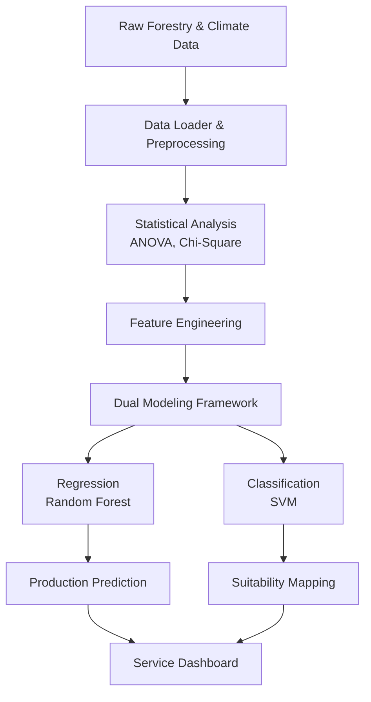

# 🏆 Developing a Business Model and Web Platform to Facilitate Forest Resource Utilization

[](https://www.python.org/downloads/)
[](https://scikit-learn.org/)
[]()

This repository contains the award-winning project for the **'2024 Forestry Statistics Smart Competition'** hosted by the **Korea Forest Service** and **Korea Forestry Promotion Institute**. The project focuses on optimizing crop cultivation and predicting production using advanced statistical analysis and machine learning techniques on forestry and environmental data.

## 🚀 Executive Summary (TL;DR)
- **The Problem**: Prospective foresters face high risks due to a lack of accessible, data-driven guidance on optimal crop cultivation locations.
- **The Solution**: Developed a web-based recommendation service mapping optimal regions for 7 major forestry crops using Soil and Climate data fusion.
- **The Result**: Won the **Grand Prize (1st Place)** by proving predictability with high AUC scores (up to 0.94) and providing actionable domain insights.

## 🛠 Tech Stack
- **Modeling**: Scikit-Learn (SVM, Random Forest, Logistic Regression)
- **Data Processing**: Pandas, NumPy
- **GIS & Spatial Analysis**: GeoPandas
- **Statistical Analysis**: SciPy (ANOVA, Chi-Square, Levene's Test)

---

## 🔬 1. Problem Definition
- **Background**: Prospective foresters and farmers face high risks and "Trial & Error" costs when deciding which crops to plant and where, due to a lack of data-driven guidance.
- **Objective**: To identify optimal cultivation regions for various forestry crops (Chestnuts, Blackberries, etc.) and predict production based on soil and climate data.
- **Vision**: "Empowering non-technical stakeholders with data-driven forestry insights."

---

## 🛠️ 2. System Architecture & Dual Modeling Framework
To process the multi-source data and provide both prediction and classification, we developed a dual-track pipeline:



---

## 📊 3. Data Acquisition & Preprocessing
To capture both macroeconomic trends and local consumer behaviors, we fused multi-source data:
- **Soil Data**: Chemistry (Acidity, Moisture), Texture, Depth, and Drainage from Forestry Service GIS.
- **Climate Data**: 30-year climate normals (Temperature, Precipitation, Humidity) from the Korea Meteorological Administration (KMA).
- **Production Data**: Historical crop yield data.

---

## 🔬 4. Statistical Analysis & Insights
Conducted Chi-Square tests, ANOVA, Levene's test, and Spearman correlation to validate relationships between soil conditions and crop production.

- **Homogeneity of Variance**: Verified the assumption of equal variances across different crop production groups.

*Figure 1: Levene's Test results showing p-values for different crop variables.*

- **Correlation Analysis**: Generated a comprehensive heatmap to analyze the complex relationships between crops and environmental variables.

*Figure 2: Correlation Heatmap between crops and climate variables.*

### 📍 Key Insights: Optimal Cultivation Conditions
Based on the analysis of mean yields in `crop_optimal_conditions.ipynb`, we identified the specific optimal soil conditions for each crop:

| Crop | Soil Depth Type (토양깊이유형) | Soil Texture Code (토성코드) | Soil Type Code (토양형코드) | Effective Moisture (토양유효수분량) |
| :--- | :---: | :---: | :---: | :---: |
| **Chestnut (밤)** | 20.0 | 1.0 | 1.0 | 5.0 |
| **Bokbunja (복분자딸기)** | 20.0 | 2.0 | 4.0 | 1.0 |
| **Ogapi (오갈피)** | 20.0 | 3.0 | 3.0 | 1.0 |
| **Yam (마)** | 20.0 | 1.0 | 1.0 | 4.0 |
| **Bellflower (도라지)** | 20.0 | 1.0 | 2.0 | 3.0 |
| **Deodeok (더덕)** | 20.0 | 3.0 | 3.0 | 1.0 |
| **Shiitake (생표고)** | 20.0 | 1.0 | 4.0 | 2.0 |

---

## 🤖 5. Modeling & Evaluation
We implemented a dual modeling framework for both prediction (Regression) and suitability classification.

#### 1. Analysis of Variance (ANOVA) Results
We identified variables with a statistically significant relationship with crop yield (p-value < 0.05):

| Crop | Significant Variable | p-value | Insight |
| :--- | :--- | :--- | :--- |
| **Blackberry** | Soil Available Water Content | **0.000004** | Soil moisture is the critical driver for yield. |
| **Deodeok** | Soil Available Water Content | **3.07e-08** | Strongest statistical relationship found. |
| **Shiitake** | Soil Available Water Content | **0.0105** | Water retention capacity dictates growth. |

#### 2. Model Performance (AUC Scores)
The models were evaluated using the Area Under the ROC Curve (AUC). The ROC curves demonstrate high predictive power for key crops:

| Crop | Model | Metric | Score (AUC) | Status |
| :--- | :--- | :--- | :---: | :--- |
| **Chestnut** | Logistic Regression | AUC | **0.94** | Excellent |
| **Yam** | Support Vector Machine (SVM) | AUC | **0.91** | Excellent |
| **Blackberry** | Random Forest Classifier | AUC | **0.84** | High Predictive Power |
| **Ogapi** | Random Forest Classifier | AUC | **0.57** | Baseline Performance |

<div style="display: flex; justify-content: space-around;">
  
  
  
</div>
*Figure 3: ROC Curves for Chestnut (AUC=0.94), Yam (AUC=0.91), and Blackberry (AUC=0.84).*

### ⚠️ Limitations & Future Work
- **Feature Limitations**: For **Ogapi** (AUC = 0.57), the low performance suggests that growth might be influenced by other latent factors (e.g., specific micro-climates, soil microbiome) not present in the current dataset.
- **Future Work**: Plan to integrate hyper-local weather data and explore deep learning approaches for spatial data to improve prediction accuracy for lower-performing crops.

---

## 🖼️ 6. Visualization & Prototype
- **Service Dashboard**: Visualized geographic information using Geopandas heatmaps and provided a recommendation list for optimal cultivation sites.


*Figure 4: Service flow and dashboard collage including Geopandas heatmap, recommendation list, and market graph.*

---

## 🏁 7. Conclusion & Business Impact
- **Outcome**: Developed a framework for a functional web service providing a "Cultivation Suitability Map" for prospective foresters.
- **Analytical ROI**:
  - **Economic Impact**: Reduced the risk for new foresters by providing scientifically validated cultivation maps.
  - **Policy Support**: Provided a data-driven justification for regional specialized crop promotion.

---

## 📁 Repository Structure
```text
├── notebooks/                  # Original exploratory Jupyter notebooks
├── src/                        # Refactored production-ready source code
│   ├── data_loader.py          # Data loading and English translation
│   ├── stat_analyzer.py        # Chi-Square, ANOVA, and Spearman analysis
│   ├── predictor.py            # Random Forest regression
│   └── classifier.py          # SVM classification for suitability
├── reports/                    # Competition reports and presentations
├── images/                     # Project screenshots and diagrams
├── run_pipeline.py             # Master pipeline runner
└── requirements.txt            # Project dependencies
```

## ⚙️ How to Run
1. Install dependencies:
   ```bash
   pip install -r requirements.txt
   ```
2. Run the full pipeline:
   ```bash
   python run_pipeline.py
   ```

## 👥 Contributors
- **Junhyung L.** (Project Lead)

---
*Refactored and polished to meet professional software engineering standards for the [Data Analyst Portfolio](https://github.com/junhyung-L).*
