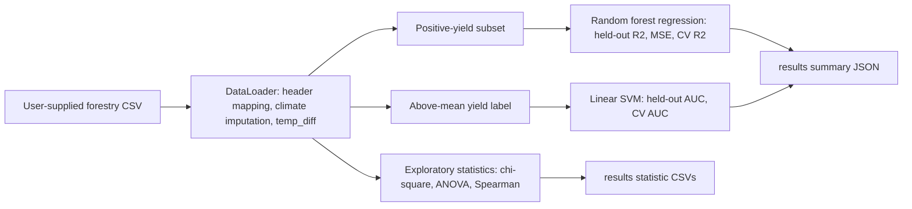
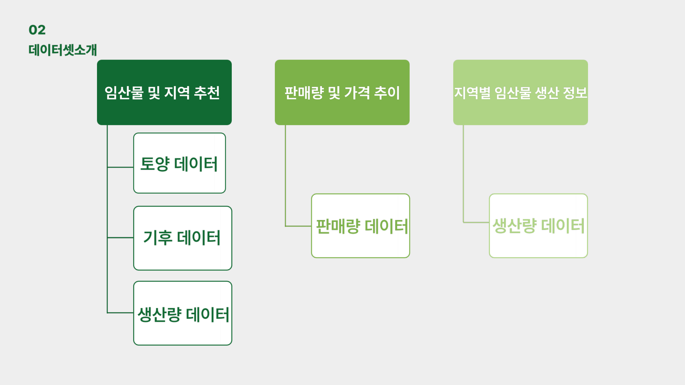
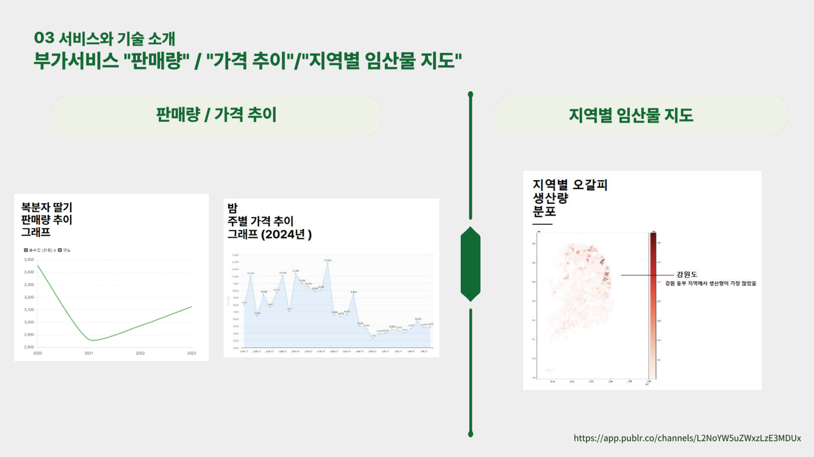

# Forestry Crop Suitability and Yield Analysis

[한국어](README.ko.md)

> [Project details](PORTFOLIO.md)

An exploratory decision-support workflow for relating forestry crop production
to soil and climate variables. The maintained Python entry point runs
statistical association checks, random-forest yield regression, and a linear
SVM suitability classifier from a CSV supplied at runtime.

> **Evidence boundary:** the raw analysis CSV is not included. The repository
> contains source links, notebooks, code, report PDFs, and retained figures,
> but cannot reproduce the historical scores below without the original input
> data and its column headers.

## Problem

The workflow investigates soil/climate associations with positive production,
predicts positive production, and classifies observations at or above mean
production for a selected crop column.

## Data boundary

`data/임업통계 데이터 셋 출처(이준형).txt` lists forestry-statistics, soil,
climate, and production-data sources. It does not contain the analysis CSV, so
row count, time coverage, geographic unit, target definition, and train/test
provenance are **UNKNOWN**.

`src/data_loader.DataLoader` expects either the historical Korean headers it
maps or already-English names such as `chestnut_kg`, `avg_temp`, `humidity`,
and `precipitation`. It fills missing climate values with each column mean and
derives `temp_diff` when maximum and minimum temperatures are available.

## Maintained workflow



## Methodology

| Stage | Maintained implementation |
|---|---|
| Statistical checks | `StatAnalyzer` tests soil-category associations against quantile-binned positive yield, runs one-way ANOVA across eligible groups, and reports Spearman correlations. These are exploratory tests, not causal estimates. |
| Regression | `CropPredictor` filters to positive production, one-hot encodes supplied features, then fits a median-imputation + random-forest pipeline. It reports an 80/20 held-out R²/MSE and shuffled CV R² with seed 42. |
| Suitability classification | `CropClassifier` defines suitability as production at or above the full-input mean, then applies imputation, scaling, and a linear SVM inside one pipeline. It uses a stratified 80/20 split and stratified CV with seed 42. |
| Outputs | `run_pipeline.py` saves Chi-square, ANOVA, Spearman tables and a JSON model summary under `results/`. |

## Retained visual evidence

The next two figures were rendered directly from the checked-in presentation
PDF (`reports/*_ppt.pdf`), rather than recreated from the unavailable raw
data.



*Figure 1. Presentation page 8 documents the historical data design: soil and
climate inputs for crop/location recommendation, plus sales/price and regional
production inputs for the companion information views. It establishes intended
data scope, not a currently reproducible data integration run.*



*Figure 2. Presentation page 23 retains market-trend and regional-production
map examples. These are historical interface/analysis artifacts, not evidence
of a deployed service or a current prediction output.*


*Figure 3. The checked-in concept collage shows the intended map,
recommendation, and market-information interface. It is a design artifact; no
deployed web application is verified in this repository.*


*Figure 4. The retained heatmap visualizes correlations among climate variables
and crop-production columns in a filtered historical dataset. It supports
exploration only and does not establish that changing a variable changes yield.*


*Figure 5. The checked-in chestnut ROC image is labeled AUC 0.94. Its raw split,
sample size, and exact generation configuration are unavailable, so it is a
historical project artifact rather than a current reproducibility benchmark.*

## Historical results retained in the repository

| Crop | Retained ROC-image label | Evidence and interpretation |
|---|---:|---|
| Chestnut | 0.94 | `images/roc_chestnut.png`; historical artifact, not rerun |
| Yam | 0.91 | `images/roc_yam.png`; historical artifact, not rerun |
| Blackberry | 0.84 | `images/roc_blackberry.png`; historical artifact, not rerun |

The former README described additional model choices and a competition award.
The raw data, split definitions, model files, external leaderboard, and award
record are not tracked here, so those claims are not presented as reproducible
outcomes.

## Run

```powershell
pip install -r requirements.txt

python run_pipeline.py `
  --input-csv path\to\forestry_data.csv `
  --crop chestnut_kg `
  --features avg_temp humidity precipitation soil_depth_type soil_texture_code
```

If the CSV uses different mapped headers, pass them explicitly through
`--crop` and `--features`. `--encoding` defaults to `cp949` and then attempts
UTF-8 variants if needed.

The command creates `results/` and writes `<crop>_chi_square.csv`,
`<crop>_anova.csv`, `<crop>_spearman.csv`, and `<crop>_summary.json`.

## Repository structure

```text
src/                  # Configuration, loading, statistics, and models
run_pipeline.py        # CLI entry point and result persistence
notebooks/             # Historical exploratory notebooks
images/                # Retained dashboard, heatmap, and ROC artifacts
reports/               # Historical report PDFs
data/                  # Source notes; raw analysis CSV excluded
```

## Limitations and next steps

- Supply a versioned raw dataset and data dictionary before interpreting a
  metric as externally valid.
- Record geographic/time splits; spatial or temporal leakage is not assessed.
- Confirm the business definition of “suitable”; the classifier uses the
  repository's above-mean-production rule, not an agronomic threshold.
- Add a baseline, calibration, uncertainty intervals, and saved model
  artifacts before operational use.
- Treat category-factorized Spearman and multiple hypothesis tests as
  exploratory; apply domain review and multiple-testing controls for research.

## Documentation

- [Portfolio case study](PORTFOLIO.md)
- [Project review](docs/PROJECT_REVIEW.md)
- [Architecture](docs/ARCHITECTURE.md)
- [CV bullet guidance](docs/CV_BULLETS.md)
