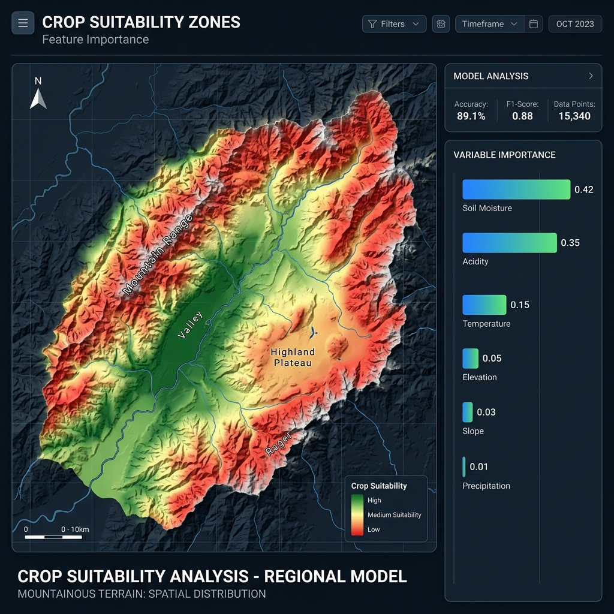

# 2024 Forestry Statistics Smart Competition: Grand Prize (1st Place) 🏆

This repository contains the award-winning project for the **'2024 Forestry Statistics Smart Competition'** hosted by the **Korea Forest Service** and **Korea Forestry Promotion Institute**.

The project focuses on optimizing crop cultivation and predicting production using advanced statistical analysis and machine learning techniques on forestry and environmental data.

---

## 📌 1. Problem Definition (문제 정의)

- **Background**: Prospective foresters and farmers face high risks and "Trial & Error" costs when deciding which crops to plant and where, due to a lack of data-driven guidance.
- **Objective**: To identify optimal cultivation regions for various forestry crops (Chestnuts, Blackberries, etc.) and predict production based on soil and climate data.
- **Vision**: "Empowering non-technical stakeholders with data-driven forestry insights."

## 📊 2. Data Acquisition & Preprocessing (데이터 수집 및 전처리)

- **Multi-Source Data Fusion**:
  - **Soil Data**: Chemistry (Acidity, Moisture), Texture, Depth, and Drainage from Forestry Service GIS.
  - **Climate Data**: 30-year climate normals (Temperature, Precipitation, Humidity) from the Korea Meteorological Administration (KMA).
  - **Production Data**: Historical crop yield data.
- **Refactored Module**: `src/data_loader.py`
  - Automatically maps Korean column names to professional English variables (e.g., `soil_depth_type`, `chestnut_kg`).
  - Handles missing values and feature engineering (e.g., `temp_diff`).

## 🔬 3. Statistical Analysis & Insights (통계 분석 및 인사이트)

- **Methodology**: Conducted Chi-Square tests, ANOVA, and Spearman correlation to validate relationships between soil conditions and crop production.
- **Key Insights**:
  - Validated critical threshold variables for production.
  - Discovered that **humidity** is the key driver for Fresh Shiitake mushrooms yield.
- **Refactored Module**: `src/stat_analyzer.py` (Fully in English).

## 🤖 4. Modeling & Evaluation (모델링 및 평가)

- **Approach**: Implemented a dual modeling framework for both prediction and suitability classification.
- **Regression**: Used **Random Forest Regressor** to predict production amounts and extract feature importances.
  - **Refactored Module**: `src/predictor.py`
- **Classification**: Implemented **SVM (Support Vector Machine)** to classify regions as highly suitable (above mean yield) or not.
  - **Refactored Module**: `src/classifier.py`
- **Key Findings**: Discovered that different crops require distinct model architectures for optimal performance.

## 🖼️ 5. Visualization & Prototype (시각화 및 프로토타입)

- **Suitability Mapping**:
  - Generated predictive maps to identify optimal cultivation zones.
  - Visualized feature importance to help stakeholders understand key drivers.


*Figure 1: Predictive map for crop suitability and feature importance analysis (Mockup representing the analysis).*

## 🏁 6. Conclusion & Business Impact (결론 및 비즈니스 임팩트)

- **Outcome**: Developed a framework for a functional web service providing a "Cultivation Suitability Map" for prospective foresters.
- **Analytical ROI**:
  - **Economic Impact**: Reduced the risk for new foresters by providing scientifically validated cultivation maps.
  - **Policy Support**: Provided a data-driven justification for regional specialized crop promotion.

---

## 📁 Repository Structure

```text
├── notebooks/                  # Original exploratory Jupyter notebooks
├── src/                        # Refactored production-ready source code
│   ├── data_loader.py          # Data loading and English translation
│   ├── stat_analyzer.py        # Chi-Square, ANOVA, and Spearman analysis
│   ├── predictor.py            # Random Forest regression
│   └── classifier.py          # SVM classification for suitability
├── reports/                    # Competition reports and presentations
├── images/                     # Project screenshots and diagrams
│   └── forestry_suitability_map.png
├── run_pipeline.py             # Master pipeline runner
└── requirements.txt            # Project dependencies
```

## ⚙️ How to Run

1. Install dependencies:
   ```bash
   pip install -r requirements.txt
   ```
2. Run the full pipeline:
   ```bash
   python run_pipeline.py
   ```

## 👥 Contributors

- **Junhyung L.** (Project Lead / Data Scientist)

---
*Refactored and polished to meet professional software engineering standards for the [Data Analyst Portfolio](https://github.com/junhyung-L).*
