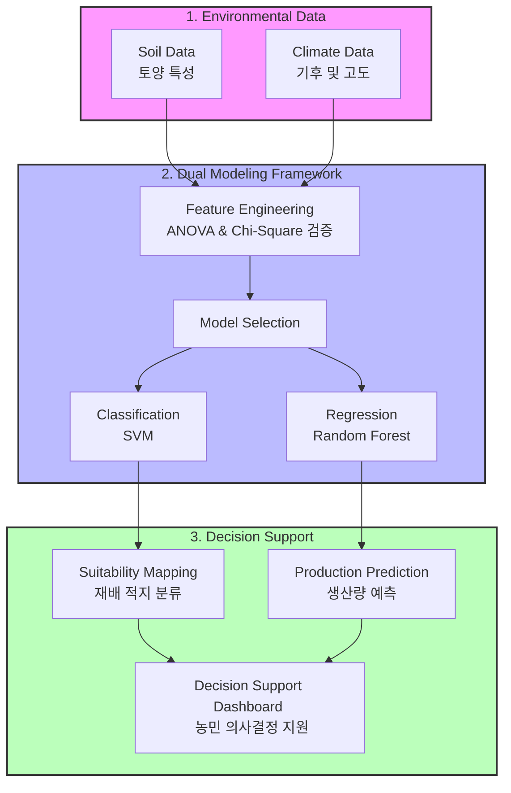
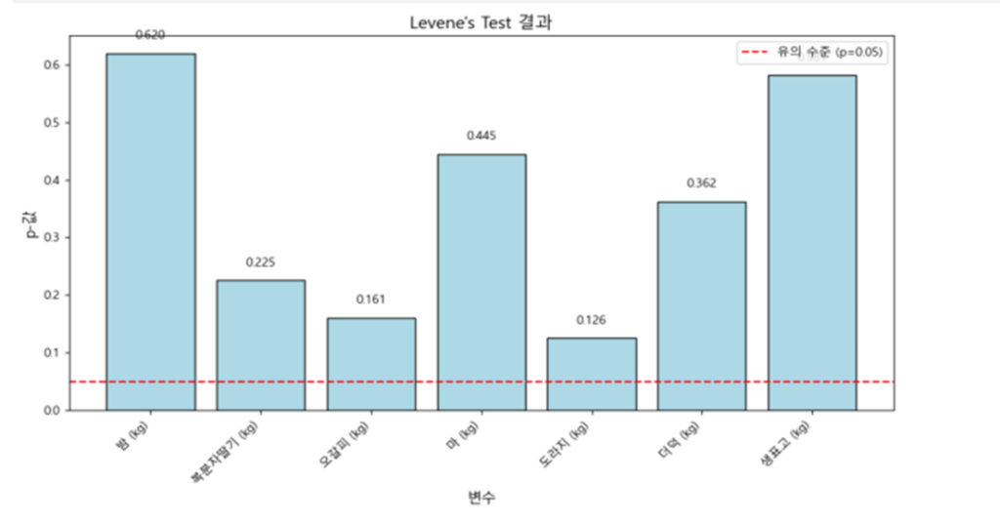
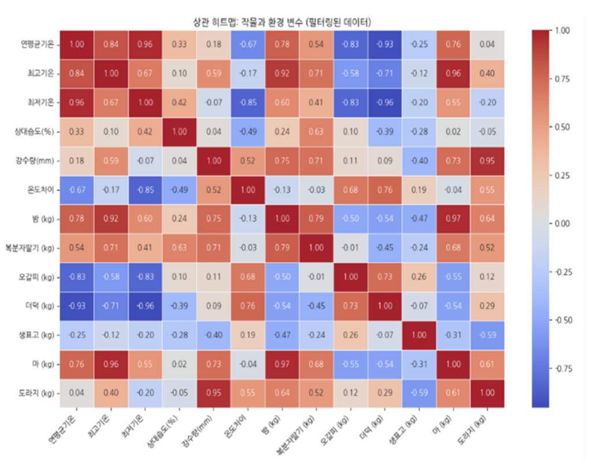
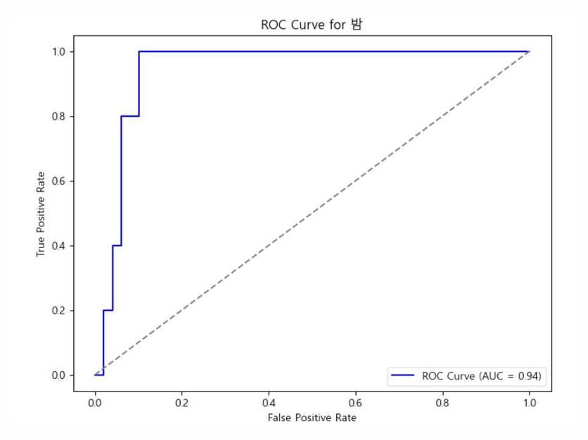
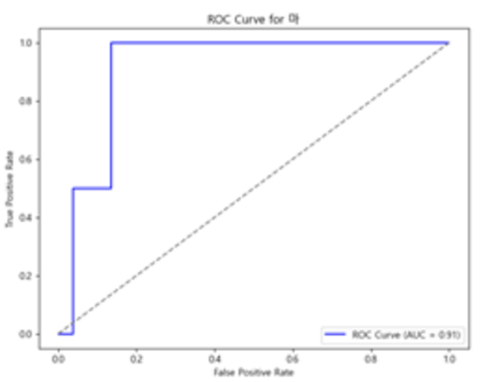
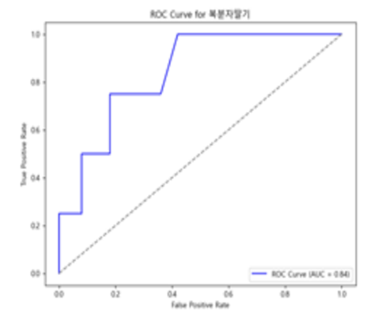
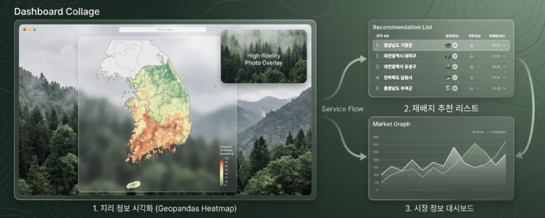

# 🏆 Developing a Business Model and Web Platform to Facilitate Forest Resource Utilization

[](https://www.python.org/downloads/)
[](https://scikit-learn.org/)
[]()

This repository contains the award-winning project for the **'2024 Forestry Statistics Smart Competition'** hosted by the **Korea Forest Service** and **Korea Forestry Promotion Institute**.

The project focuses on optimizing crop cultivation and predicting production using advanced statistical analysis and machine learning techniques on forestry and environmental data.

## 🚀 Executive Summary (TL;DR)
- **The Problem**: Prospective foresters face high risks due to a lack of accessible, data-driven guidance on optimal crop cultivation locations.
- **The Solution**: Developed a web-based recommendation service mapping optimal regions for 7 major forestry crops using Soil and Climate data fusion.
- **The Result**: Won the **Grand Prize (1st Place)** by proving predictability with high AUC scores (up to 0.94) and providing actionable domain insights.

## 🛠 Tech Stack
- **Modeling**: Scikit-Learn (SVM, Random Forest, Logistic Regression)
- **Data Processing**: Pandas, NumPy
- **GIS & Spatial Analysis**: GeoPandas
- **Statistical Analysis**: SciPy (ANOVA, Chi-Square, Levene's Test)

---

## 📌 1. Problem Definition (문제 정의)
- **Background**: Prospective foresters and farmers face high risks and "Trial & Error" costs when deciding which crops to plant and where, due to a lack of data-driven guidance.
- **Objective**: To identify optimal cultivation regions for various forestry crops (Chestnuts, Blackberries, etc.) and predict production based on soil and climate data.
- **Vision**: "Empowering non-technical stakeholders with data-driven forestry insights."



---

## 📊 2. Data Acquisition & Preprocessing (데이터 수집 및 전처리)
- **Multi-Source Data Fusion**:
  - **Soil Data**: Chemistry (Acidity, Moisture), Texture, Depth, and Drainage from Forestry Service GIS.
  - **Climate Data**: 30-year climate normals (Temperature, Precipitation, Humidity) from the Korea Meteorological Administration (KMA).
  - **Production Data**: Historical crop yield data.
- **Refactored Module**: `src/data_loader.py`
  - Automatically maps Korean column names to professional English variables (e.g., `soil_depth_type`, `chestnut_kg`).
  - Handles missing values and feature engineering (e.g., `temp_diff`).

## 🔬 3. Statistical Analysis & Insights (통계 분석 및 인사이트)
- **Methodology**: Conducted Chi-Square tests, ANOVA, Levene's test, and Spearman correlation to validate relationships between soil conditions and crop production.
- **Homogeneity of Variance (Levene's Test)**: Verified the assumption of equal variances across different crop production groups to ensure valid ANOVA results.

*Figure 2: Levene's Test results showing p-values for different crop variables.*

- **Correlation Analysis**: Generated a comprehensive heatmap to analyze the complex relationships between crops and environmental variables.

*Figure 3: Correlation Heatmap between crops and climate variables.*

- **Key Insights**:
  - Validated critical threshold variables for production.
  - Discovered that **humidity** is the key driver for Fresh Shiitake mushrooms yield (p-value < 0.05).
- **Refactored Module**: `src/stat_analyzer.py` (Fully in English).

## 🤖 4. Modeling & Evaluation (모델링 및 평가)
- **Approach**: Implemented a dual modeling framework for both prediction (Regression) and suitability classification.

Instead of relying on generic accuracy scores, the project focused on identifying statistically significant drivers of production and mapping their impact via regression coefficients.

#### 1. Analysis of Variance (ANOVA) Results
We identified variables with a statistically significant relationship with crop yield (p-value < 0.05):

| Crop | Significant Variable | p-value | Insight |
| :--- | :--- | :--- | :--- |
| **Blackberry (복분자딸기)** | Soil Available Water Content | **0.000004** | Soil moisture is the critical driver for yield. |
| **Deodeok (더덕)** | Soil Available Water Content | **3.07e-08** | Strongest statistical relationship found. |
| **Shiitake (생표고)** | Soil Available Water Content | **0.0105** | Water retention capacity dictates growth. |

#### 2. Model Feature Importance (Coefficients)
Feature importances (coefficients) derived from the predictive models revealed the directional impact of key variables:

*   **Chestnut (밤)**: Thrives in sandy loam (양토). Best modeled with **Logistic Regression** due to linear relationships.
*   **Yam (마)**: Showed the best performance with **SVM** for suitability classification.
*   **Shiitake (생표고)**: Humidity is critical (optimal 85-95%). Interestingly, the impact of temperature is decreasing due to the spread of modern sawdust cultivation (톱밥 재배) methods.
*   **Ogapi & Deodeok (오갈피 & 더덕)**: Large temperature differences in high-altitude regions (200-800m) are optimal for sugar accumulation and quality. Best modeled with **Random Forest**.
*   **Bellflower (도라지)**: Requires sufficient precipitation (100-150mm) and high temperature differences.

#### 3. Model Performance (AUC Scores)
The models were evaluated using the Area Under the ROC Curve (AUC). The ROC curves demonstrate high predictive power for key crops:

| Crop | Model | Metric | Score (AUC) | Status |
| :--- | :--- | :--- | :---: | :--- |
| **Chestnut (밤)** | Logistic Regression | AUC | **0.94** | Excellent |
| **Yam (마)** | Support Vector Machine (SVM) | AUC | **0.91** | Excellent |
| **Blackberry (복분자딸기)** | Random Forest Classifier | AUC | **0.84** | High Predictive Power |
| **Ogapi (오갈피)** | Random Forest Classifier | AUC | **0.57** | Baseline Performance |

<div style="display: flex; justify-content: space-around;">
  
  
  
</div>
*Figure 4: ROC Curves for Chestnut (AUC=0.94), Yam (AUC=0.91), and Blackberry (AUC=0.84).*

*   **Insight**: The model performs exceptionally well for **Chestnut** and **Yam** (AUC > 0.90), and **Blackberry** (AUC = 0.84), indicating that the selected soil and climate features are strong predictors.
*   **Challenge & Future Work**: For **Ogapi** (AUC = 0.57), the performance suggests that growth might be influenced by other latent factors not in the dataset, presenting a clear direction for future feature engineering.

- **Regression**: Used **Random Forest Regressor** to predict production amounts and extract feature importances.
  - **Refactored Module**: `src/predictor.py`
- **Classification**: Implemented **SVM** to classify regions as highly suitable (above mean yield) or not.
  - **Refactored Module**: `src/classifier.py`
- **Key Findings**: Discovered that different crops require distinct model architectures for optimal performance (e.g., non-linear relationships in soil data were better captured by Random Forest).

> [!NOTE]
> **Model Refactoring Note**: The original competition study explored multiple algorithms (SVM, Random Forest, Logistic Regression) tailored to each crop's characteristics. However, for the refactored production pipeline in this repository, a unified framework using **SVM (for classification)** and **Random Forest (for regression)** was implemented to ensure maintainability and scalability of the code.

## 🖼️ 5. Visualization & Prototype (시각화 및 프로토타입)
- **Service Dashboard**:
  - Visualized geographic information using Geopandas heatmaps.
  - Provided a recommendation list for optimal cultivation sites.
  - Displayed market trends and price analysis.


*Figure 1: Service flow and dashboard collage including Geopandas heatmap, recommendation list, and market graph.*

## 🏁 6. Conclusion & Business Impact (결론 및 비즈니스 임팩트)
- **Outcome**: Developed a framework for a functional web service providing a "Cultivation Suitability Map" for prospective foresters.
- **Analytical ROI**:
  - **Economic Impact**: Reduced the risk for new foresters by providing scientifically validated cultivation maps.
  - **Policy Support**: Provided a data-driven justification for regional specialized crop promotion.

### 💡 Decision Support for Non-Technical Users (비전문가를 위한 의사결정 지원)
To ensure that complex machine learning results are actually useful to farmers and prospective foresters (who may not have technical backgrounds):
- **Intuitive Metrics**: The classification results are translated into a simple 3-tier rating (Highly Suitable, Moderately Suitable, Unsuitable) rather than raw probability scores.
- **Actionable Dashboard**: The model feeds into a Geopandas-based heatmap dashboard, allowing users to visually inspect their land without reading a single line of code.
- **Scalability**: This architecture serves as a baseline that can be easily ported to mobile apps or web services for real-time field consultation.

---

## 📁 Repository Structure
```text
├── notebooks/                  # Original exploratory Jupyter notebooks
├── src/                        # Refactored production-ready source code
│   ├── data_loader.py          # Data loading and English translation
│   ├── stat_analyzer.py        # Chi-Square, ANOVA, and Spearman analysis
│   ├── predictor.py            # Random Forest regression
│   └── classifier.py          # SVM classification for suitability
├── reports/                    # Competition reports and presentations
├── images/                     # Project screenshots and diagrams
│   └── dashboard_collage.png  # User-provided service dashboard
├── run_pipeline.py             # Master pipeline runner
└── requirements.txt            # Project dependencies
```

## ⚙️ How to Run
1. Install dependencies:
   ```bash
   pip install -r requirements.txt
   ```
2. Place the data file:
   - Save the raw dataset as `forestry_data.csv` in the `data/` directory.
3. Run the full pipeline:
   ```bash
   python run_pipeline.py
   ```

## 👥 Contributors
- **Junhyung L.** (Project Lead)

---
*Refactored and polished to meet professional software engineering standards for the [Data Analyst Portfolio](https://github.com/junhyung-L/Resume/blob/main/Portfolio/README.md).*
*Note: Statistical findings and feature importances are based on the actual competition report results.*

