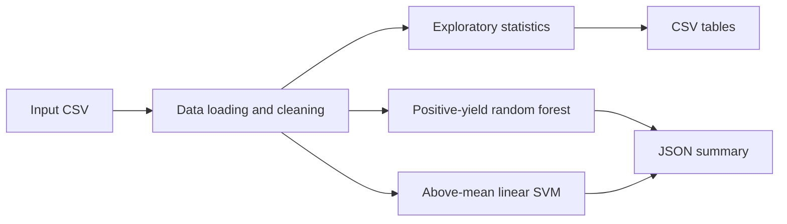

# Architecture

The reproducible path starts at `run_pipeline.py`, not the historical
notebooks. Supply the CSV path, target crop column, and feature columns; the
CLI validates what is available after the stored header mapping.

`CropPredictor` and `CropClassifier` keep imputation—and classification
scaling—inside sklearn pipelines. This prevents those transforms from being
fit on holdout rows or cross-validation validation folds.

The maintained CLI and `src/` modules are the reference for component details
and historical-code boundaries.
